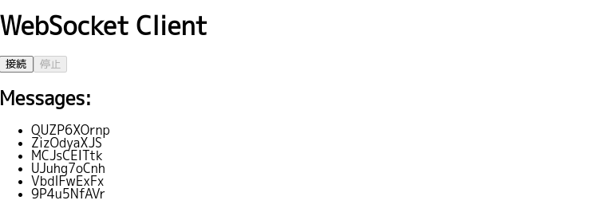

# WebSocket Client with React

This is a simple React-based WebSocket client application. The client connects to a WebSocket server and displays the messages received from the server. It includes "Connect" and "Disconnect" buttons to manage the WebSocket connection.

Use [websocketsrv-demo-go](https://github.com/zinrai/websocketsrv-demo-go) for websocket server.

## Features

* Real-time Communication: Establish a WebSocket connection to receive real-time messages from a server.
* Connection Management: Easily connect and disconnect from the WebSocket server using buttons.
* Message Display: View all messages received from the WebSocket server in a list.



## Installation

To run this WebSocket client locally, follow these steps:

1. Install the dependencies:

Ensure you have Node.js installed. Then run:

    ```
    $ npm install
    ```

2. Run the development server:

    ```
    $ npm start
    ```

This will start the React development server. Open your browser and navigate to `http://localhost:3000` to see the application in action.

## Usage

* Connect: Click the "Connect" button to initiate a WebSocket connection to the server specified in the code (ws://localhost:8080 by default).
* Disconnect: Click the "Disconnect" button to close the WebSocket connection.
* Messages: Any messages sent from the WebSocket server will be displayed in the list under "Messages".

## Project

```
├── public
│   ├── index.html         # Main HTML file
│   └── ...
├── src
│   ├── WebSocketComponent.jsx  # WebSocket client component
│   ├── App.js                  # Main application component
│   └── index.js                # Entry point for React
├── package.json
└── README.md
```

* WebSocketComponent.jsx: This component contains the logic for connecting to and disconnecting from the WebSocket server, as well as displaying the received messages.
* App.js: The main React component that renders the WebSocketComponent.

## License

This project is licensed under the MIT License - see the [LICENSE](https://opensource.org/license/mit) for details.
